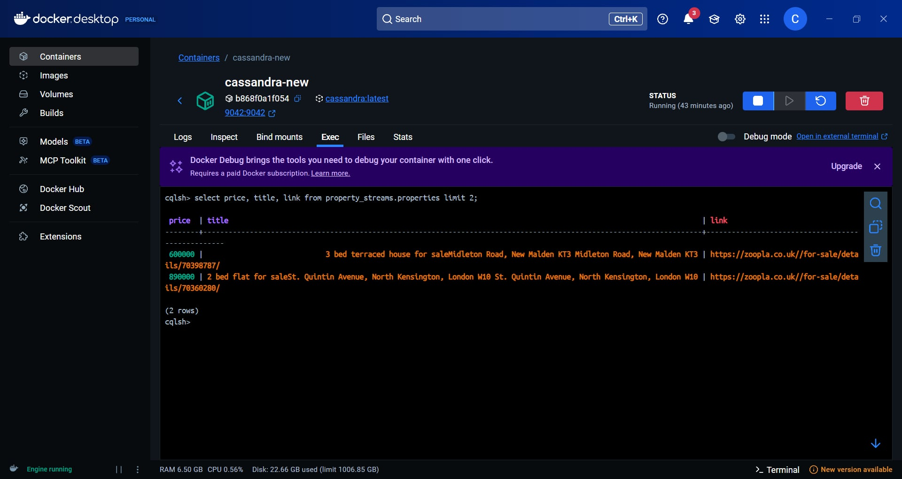

# Real-Estate-Data-Engineering-Project

## Overview

This project focus on building a Real Estate End to End Data Engineering.Data gathering starts with WebSocket/CDP, moving into Apache Kafka for reliable transport. Apache Spark (Master-Worker) handles scalable transformation, while Apache Zookeeper and Confluent Control Center manage and monitor the messaging. Final processed data is stored in the scalable NoSQL database, Cassandra.

## Table of Contents
- [Overview](#overview)
- [Architecture](#architecture)
- [Dataset Used](#dataset-used)
- [Step in This Project](#step-in-this-project)
- [Results](#results)

## Architecture

### Tech Stacks
1. Programming Language - Python
2. Apache Kafka
3. Apache Zookeeper
4. Cassandra
5. Apache Spark

## Dataset Used

##### Find UK houses and property for sale
Power up your search with Zoopla
Whether you're looking for your first flat, a family home or an investment, finding the perfect property for sale just got easier.

- Filters only on Zoopla: Fixer uppers, reduced prices, utility rooms, homes with EV charging - you name it, we’ve got a filter for it.
- Instant property alerts: Be the first to know about new properties, as soon as they hit the market.
- Property insights: Dig deeper into every house with data on planning applications, flood risks and more.

With new properties for sale every day and smart tools to help you on your way, we make sure you move with confidence.

More information : https://www.zoopla.co.uk/

## Step in This Project
1. Data Gathering & Ingestion: Data is dynamically gathered from real estate sources using a WebSocket connection and Chrome DevTools Protocol (CDP) for efficient, low-latency communication. 
2. Messaging & Decoupling: Ingested data is sent to Apache Kafka for reliable, asynchronous messaging. Apache Zookeeper manages the Kafka cluster, while the Confluent Control Center provides a unified interface for monitoring and managing the streaming ecosystem.
3. Data Processing & Transformation: The pipeline utilizes Apache Spark running on a Master-Worker Architecture (managed by Docker) to perform scalable, distributed data processing. This phase involves critical transformations, validation, and cleaning of the raw streaming data.
4. Final Storage & Persistence: The processed and refined data is finally persisted into Cassandra, a highly scalable, fault-tolerant NoSQL database, optimized for high-volume, continuous writes and fast lookups.

## Results
1. Extract Data

2. Data load to cassandra

